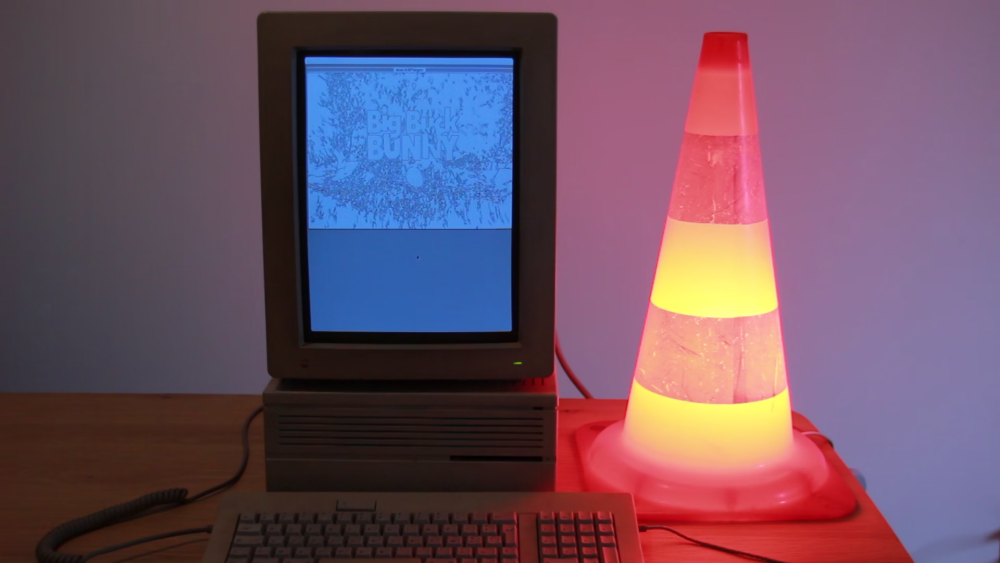

# mac68Player

mac68Player is a very basic player that allows to watch your videos on old Macintoshes based on 68k Motorola processor
after having converted into a custom format.
You can watch a demonstation video [here](https://www.youtube.com/watch?v=EPGhH5Oy9PE).



This repository contains the mac68Player source code and the `genVideo.sh` script.
The scripts converts an input video to monochrome by extracting the edges.
It also resamples the sound and multiplexes it with the video frames in an output file.

## Compilation

mac68Player was developped using the great [Retro68 toolchain](https://github.com/autc04/Retro68) based on GCC.
To compile mac68Player, you must first compile Retro68 by following the instructions available on its repository.
You also need CMake.

Make a build directory and configure, using cmake:
```
mkdir build; cd build
cmake .. -DCMAKE_TOOLCHAIN_FILE=/path/to/Retro68-build/build-target/cmake/retro68.toolchain.cmake
```

You can then compile:
```
make
```

Retro68 generates an `mac68Player.img` Mac image file.
It contains the compiled program. You can drag it onto your Mini vMac emulator.
It will appear inside the emulator as a new drive that contains the mac68Player executable.

A MacBinary `mac68Player.bin` file is also generated. You can transfer this file on an old Macintosh and convert it to a Mac
executable by dragging it onto the MacBinary program.

## Creating an input video

Use the `genVideo.sh` script to generate a video you can play with mac68Player.
This scripts requires `ffmpeg` and a `python3` distribution with `numpy` and `opencv-python`.
You can install the python dependancies inside a virtualenv with `pip install -r requirements.txt`.

Run the script using:
```
./genVideo.sh my_input_video.ext
```

You can change the exported video resolution by modifying the constants into the `genVideo.sh` and `convertVideo.py` scripts
as well as the `main.c` source file. Descrease the resolution if you want to reduce the size of the converted videos.
The frames and the sound samples are indeed stored uncompressed in the output file.

This script generates the output `video.dat` video file you can directly transfer on a real Mac and open with mac68Player.
If you are using the Mini vMac emulator, a `video.img` can be dragged onto the emulator.
It then appears inside the eumulator as a new drive that contains the `video.dat` file.

## Notes

Due to hardware limitations, the sound should be choppy on Macintosh Plus and Macintosh SE.
